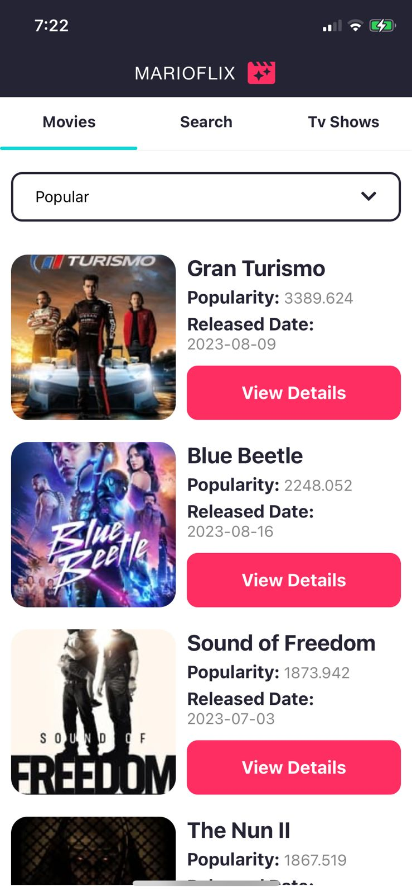
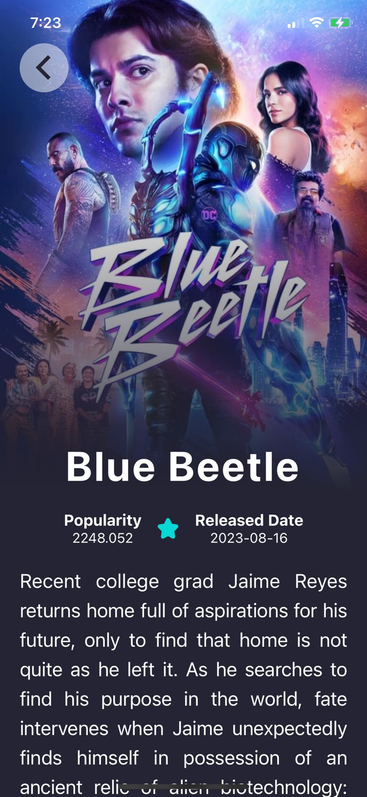

# Marioflix 🎥 (movie app)
### 📜 Table of Contents:

- [👋 About](#about)
- [🖥️ Preview](#%EF%B8%8Fpreview)
- [😊 Main Features](#main-features)
- [🔨 Tech Stack](#tech-stack)

---

### 👋 About:

"Marioflix" 😎 is a versatile and user-friendly mobile application developed using React Native. It serves as a tool for users to explore and discover movies and TV shows. The app provides a seamless and interactive experience for users to browse, search, and access detailed information about their favorite films and TV series.

---

### 🖥️ Preview:

## Movies/TV Shows 🎥

## Search Functionality 🔍

## Movie/TV Show Details 📚

---

### 😊 Main Features:

**🎥 Movies:** – Tab #1

-Browse a vast collection of movies from various genres, including popular, top-rated, now playing, and upcoming films. Get detailed information about each movie, including its title, release date, and synopsis.

**🔍 Search:** – Tab #2

-Use the powerful search functionality to find movies and TV shows by title, keywords, or actor names.

**📺 TV Shows:** – Tab #3

-Explore a wide selection of TV shows, including the latest episodes and seasons. Find information about TV show titles, and release dates.

---

### 🔨 Tech Stack:

- **Front-end:** React Native, JavaScript, CSS
- **Back-end:** No back-end
- **Packages / Others:** Axios, React Native Elements, Reanimated, Dropdown Select List, React Navigation, Expo Icons
- **APIs:** The Movie Database (TMDb) API
